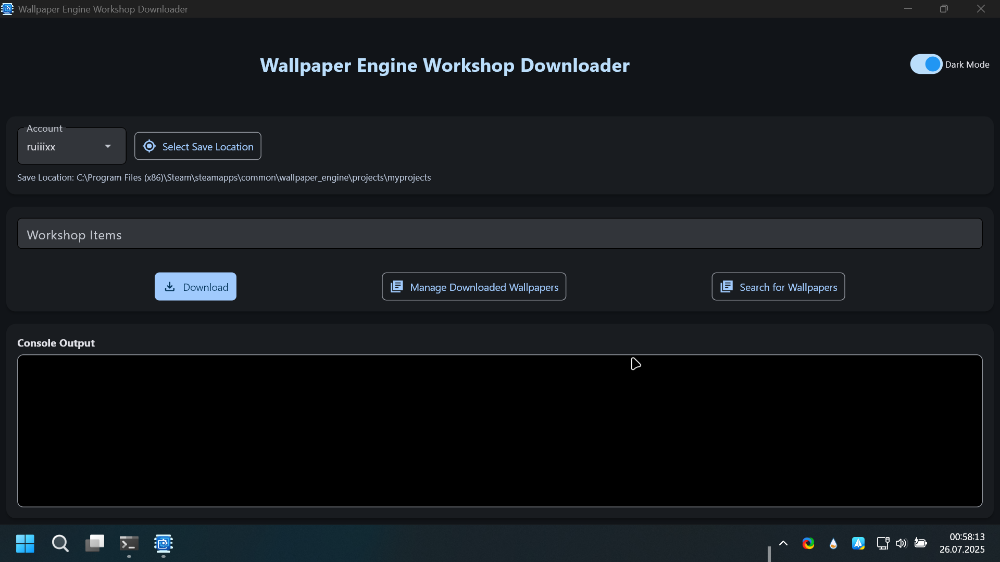

# WallpaperEngineGrabber 🚀

WallpaperEngineGrabber is a tool designed to help you download and manage wallpapers from the Wallpaper Engine Workshop with ease.

## ✨ Features
- 🖼️ Download wallpapers directly from the Wallpaper Engine Workshop.
- 🧑‍💻 Simple and user-friendly interface.
- 📁 Organize and manage your downloaded wallpapers efficiently.

## How to Use
1. Clone this repository to your local machine.
2. run WallpaperDownloader.py with the [latest Python Version](https://www.python.org/downloads/) (not with IDE!)
3. Enjoy your favorite wallpapers!

## 📝 Note
Original project by [Oureveryday](https://github.com/oureveryday/WallpaperEngineWorkshopDownloader). This project is inspired by and builds upon his work.

## 📄 License
This project is licensed under the terms of the MIT License.

## Support me, my hard work and future development:
Crypto Wallet Adress: 0xfbe3E2337e7bCfC9245f0C2eAeF16597f0Bb2Dc2 (ETH, LTC, BNB)

